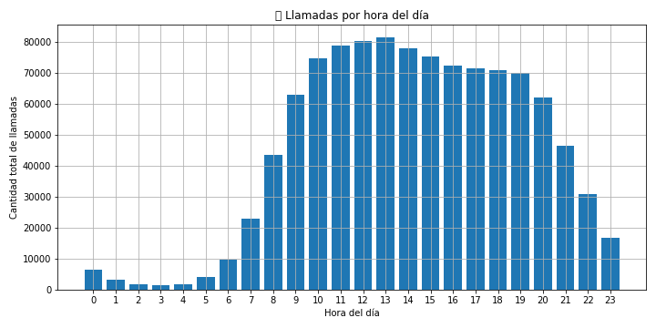

# GRANDATA PROJECT


## Resultados de los ejercicios
### Ejercicio 1
- Punto 1: Monto total a facturar: $391367.00
- Punto 2: El dataset en formato parquet pueden encontrarlo en la carpeta output. 
+---------+---------------+--------------------------------+
|id_source|monto_facturado|id_md5                          |
+---------+---------------+--------------------------------+
|4D3      |23403.0        |911914c7729eedbdf5b0f03159f451a9|
|76D      |13664.0        |bd180b7811395cbce5076b52a78ca50d|
|07E      |4226.0         |14a0660ae2f5d186882df86c2972fa93|
|541      |2526.0         |16c222aa19898e5058938167c8ab6c57|
|C25      |2019.0         |0bfa0b57d99985aa138ce05055a3c5db|
|17D      |1209.0         |7521526054bb89ba243073f7e5e541ec|
|3AE      |1087.5         |6a57072949dbc409cc48ef7bd8b05335|
|B86      |1054.5         |bc97b32ee2abb9c18aad55b9da9f51c0|
|E89      |979.5          |5135cc35322269f2fb397b4f81426938|
|B71      |972.0          |1088a10d026eae0ac20f59f5249db2ea|
|162      |887.5          |82aa4b0af34c2313a562076992e50aa3|
|068      |854.5          |fb8490a9504a36c212b5a1be7b4ca7e4|
|A2C      |691.5          |d7dcc6703e425a6e39d6ebaf31cba1bd|
|335      |681.0          |f9b902fc3289af4dd08de5d1de54f68f|
|1BD      |679.0          |f5a45e33602ea62f9498f9d9bb86fc3e|
|3E0      |661.5          |e9d076deb3451cc49819dbc8ed8be7a7|
|76F      |644.0          |1b9204fd05eed7af9ec2ffb0891d84ab|
|6FB      |598.5          |dbcec12ccfc780516eaf452d1d81dd07|
|5D7      |596.5          |d688a78f3638bed0c340ea5ccb972dae|
|84C      |591.5          |f33e3ebc2d9aab9c9a14f2368bec2234|
|FCA      |589.5          |17dfecb54551e0419a4c1b2ba0ee1cf3|
|CF6      |578.0          |3f77e9dfaa037a763ff92fe430985fa4|
|FCF      |554.5          |3e3b743072cab31dc32129a15e816b00|
|0ED      |537.5          |c724fe713b0fc3518eb4e828f0528065|
|CF5      |533.5          |5b8d270f2027a50bf985882a6ff08dc5|
|6A4      |531.0          |5dd9f6f36a6f6d64d887708cf036b450|
|D03      |516.5          |6b9a20a85d8e795d94d47905a75f6ed3|
|FC4      |516.5          |d4e6edd43a77720f39db745caa6dd23b|
|046      |511.0          |bf97f24695f24fac060bc44b4e97acc1|
|C09      |509.5          |166df274636b006e18b32a095829ffdc|
|756      |507.0          |2823f4797102ce1a1aec05359cc16dd9|
|23C      |503.5          |428cdff1010350e01ff31cf9690f27e0|
|08D      |502.5          |f1b82e0bb80be61e2b8ae3a610b9a06d|
|EB1      |498.5          |f0b303b94865daaba2226c8dc0c07353|
|215      |496.0          |3b8a614226a953a8cd9526fca6fe9ba5|
|414      |486.5          |66808e327dc79d135ba18e051673d906|
|897      |468.5          |5705e1164a8394aace6018e27d20d237|
|E98      |464.0          |ccdafd146e9ec355a7ab32313074efa6|
|328      |463.5          |cd00692c3bfe59267d5ecfac5310286c|
|14E      |458.0          |15ca77704847cf3512a011afe8f1ee9a|
|101      |456.0          |38b3eff8baf56627478ec76a704e9b52|
|650      |452.5          |884d247c6f65a96a7da4d1105d584ddd|
|D0B      |448.0          |e87c495061191f4df1ddef45f48bb532|
|E33      |445.5          |43119835da4fc8ef2eaf3337536e78d4|
|F81      |445.5          |0a295ce1395dd390fe66ffd4726fc69e|
|EA0      |444.0          |ea01df294baecce9f9956e4d26c7d5e5|
|280      |443.0          |92c8c96e4c37100777c7190b76d28233|
|E6D      |440.0          |69b2e8cd08123eb60ed65d5257dbd7e3|
|975      |433.0          |92977ae4d2ba21425a59afb269c2a14e|
|249      |428.5          |077e29b11be80ab57e1a2ecabb7da330|
|A4C      |428.5          |24650106de16db2ead5d2b22cdb2f506|
|4B6      |426.5          |74f7fae6893bbd6975ce7525a62705a8|
|BBD      |426.0          |80e01d9926b54fe729410d78954faada|
|683      |424.5          |24681928425f5a9133504de568f5f6df|
|373      |420.5          |ffd52f3c7e12435a724a8f30fddadd9c|
|EB8      |420.0          |c7cac25e467ff56c613d3a58b02e50c9|
|BD4      |418.5          |aa35b36e4d1395542d0da8f9b2138eb3|
|11C      |414.0          |0816da75e13696127a3ca692ccc9d06b|
|26C      |412.5          |e14f1796bb09967d4d815ebbdbc39d85|
|ADC      |412.0          |72c1bba79e6502c017bd14bc00a68491|
|512      |407.0          |10a7cdd970fe135cf4f7bb55c0e3b59f|
|205      |397.0          |eae27d77ca20db309e056e3d2dcd7d69|
|BD8      |395.0          |1bfd138f9868e50335554d0fbe885444|
|98E      |389.0          |e18ae378707d248df94abfe56f03cb46|
|8EF      |384.5          |2e38f1234de642c41f249957d39327d0|
|C82      |384.0          |41fc05922ac4a713bdb2745844c459cd|
|F4B      |383.5          |826893e53afeff983c29371c01586efb|
|CB9      |377.0          |4973b1efa94d92c67c10753c84f281b1|
|857      |376.0          |847cc55b7032108eee6dd897f3bca8a5|
|276      |375.0          |db8e1af0cb3aca1ae2d0018624204529|
|062      |375.0          |18230e1fb6e5dd3cfb0bcec4f863e167|
|E6F      |373.5          |159e1f3d6ff0e7c3c2ff9770edc52cdf|
|370      |371.5          |d709f38ef758b5066ef31b18039b8ce5|
|696      |369.5          |0cb929eae7a499e50248a3a78f7acfc7|
|D7E      |367.0          |3a72ee86a619cc657f1c9f680f3cf0cd|
|ED0      |361.5          |46e7fae94d655842456ba2612f643d46|
|A89      |360.5          |19973e320d023a6ccab786f1fa37c40d|
|F02      |358.0          |c82429e8d9bfeb1caa3ac2f848155553|
|099      |357.0          |8638096e4ddb49a0dd6592c57d9f50ab|
|AC2      |356.0          |6bc3eef723f38424d37d245db8999d89|
|212      |355.5          |1534b76d325a8f591b52d302e7181331|
|A62      |355.0          |c7478a62a4accad1d3fef0cbe6fd67c0|
|4B2      |355.0          |003ad525037042448addfad1371486c3|
|4AD      |351.0          |bed5c94ae8b83526e565cab6c994966f|
|7D8      |350.0          |ecd6be44643bef66ca2b4e8aae5fb3f1|
|1DF      |350.0          |ccc83e5d7011c8df9cc263a2bac0a8f4|
|DFF      |349.5          |bca5fd6b639c7cbf0c78eb9f68d35303|
|DB0      |349.0          |25e64a7f5d1b7073c91470926f61298a|
|D76      |348.5          |ec0a088096d726f7c8e6ddfd8913dd88|
|929      |348.5          |0d0871f0806eae32d30983b62252da50|
|DA5      |346.0          |6a5a0d32c4c51782382bff11d2b894da|
|FD6      |346.0          |a77a18b48cbfc93dfad96164c6a2afec|
|6CB      |345.5          |2921d694e1ab35276513480a8fdeb926|
|054      |344.5          |f75c3dad51560c41ab90ac39560d7a2a|
|EDD      |343.0          |007a277fe5e8059aab75258b67324b35|
|42D      |342.5          |57f2173ca61c078b3ec25e446afaddab|
|2CD      |342.5          |abd3ae089c623abfc73804641f891c65|
|59F      |339.5          |26625083960de6fd20f75b505e27e0ca|
|BCD      |337.0          |8539ef1fba74a70f5a77fcc3f25c1659|
|047      |332.5          |2c4a8495407bfb55ce1a93970445bd38|
+---------+---------------+--------------------------------+
- Punto 3: El histograma se puede encontrar en la carpeta output.


### Ejercicio 2
Si bien no tengo experiencia directa con Hadoop, sí instalé y trabajé con un clúster Apache Spark en modo standalone sobre tres instancias virtuales. En esa configuración definí un nodo como master y dos como workers, y ejecuté pipelines desde Airflow hacia ese entorno distribuido. Para responder estas preguntas me basé tanto en esa experiencia como en una investigación puntual sobre Hadoop y YARN.

#### Pregunta General - 1
Investigué cómo funciona YARN y los schedulers que ofrece. Si tuviera que priorizar procesos productivos, usaría colas diferenciadas en el scheduler CapacityScheduler. La cola del pipeline productivo tendría mayor capacidad mínima, prioridad más alta y posiblemente activaría la opción de pre-emption si usara FairScheduler, para garantizar que siempre tenga recursos disponibles. También limitaría la cantidad de tareas exploratorias concurrentes para evitar saturar el cluster.

Como estrategia, programaría los procesos productivos en ventanas de baja actividad, como la madrugada, para evitar competir por recursos con tareas exploratorias. También los aislaría temporalmente usando triggers o ventanas de ejecución programadas.

Para orquestar esto, tengo experiencia usando Airflow y Dagster que permiten definir dependencias y controlar el momento exacto de ejecución de cada job.

#### Pregunta General - 2
Sobre este punto, pensando en mi experiencia pasada veo 2 posibles causas
- Esto se puede dar debido a una mala estrategia de particiones ya que las consultas podrían estar escaneando muchos más datos de los necesarios.
- Bajo rendimiento en la acumulación de archivos pequeños (incluso dentro de las particiones) generados por las actualizaciones diarias. Esto impacta negativamente en la performance porque Spark debe manejar y leer gran cantidad de metadatos y archivos individuales.

Para mejorar esto, sugeriría:
- Aplicar partitioning por una columna como fecha (por ejemplo, fecha_evento) para reducir el volumen de datos escaneados.
- Realizar compactación periódica para reducir small files
- Otra posible solución sería usar Delta Lake, que soporta actualizaciones eficientes, transacciones ACID y permiten aplicar optimizaciones como OPTIMIZE(para compactar) y ZORDER BY (ordenar los registros dentro de la partición lo que optimiza el corte en la busqueda mas rápido cuando encuentra el registro).

- Usar cache() con cuidado en tablas que se consultan mucho y no cambian durante la sesión.

- Otro solución, no tan frecuente, que use en el pasado fue generar una replicación actualizada de la tabla con diferentes tipos de particionados armados particularmente para responder a diferentes tipos de acceso a los datos. La única desventaja de este caso es mantener la consistencia e integridad de los datos ya que el espacio de disco es barato hoy en día. 

#### Pregunta General - 3 
Una posible configuración para cumplir con este punto sería:
```
spark = SparkSession.builder \
    .appName("ProcesoControlado") \
    .config("spark.executor.instances", "3") \
    .config("spark.executor.memory", "24g") \
    .config("spark.executor.cores", "6") \
    .config("spark.driver.memory", "3g") \
    .getOrCreate()
```
Explicación: Para usar solo la mitad del clúster, calcularía los recursos totales disponibles (150 GB y 36 cores) y luego limitaría el job a 3 ejecutores de 24 GB y 6 cores cada uno. Así, uso 72 GB y 18 cores, quedando la otra mitad libre.

Opción 2: Como vi en la investigación previa, usando CapacityScheduler en YARN podria usar una cola con un capacity del 50% y un maximium capacity de 50% asegurandome que no pueda superar el 50% de los recursos.

Otra opción: Si configuro cada executor con 6 cores y 24 GB de RAM, y habilito dynamic allocation con:

```
.config("spark.dynamicAllocation.enabled", "true")
.config("spark.dynamicAllocation.minExecutors", "1")
.config("spark.dynamicAllocation.maxExecutors", "3")
```
Entonces, el job podrá escalar dinámicamente, pero nunca va a usar más de 3 executors, lo que me garantiza que el consumo máximo será:
- 3 × 6 cores = 18 cores
- 3 × 24 GB = 72 GB

Eso representa aproximadamente la mitad del clúster. Pero esta opción no es ideal ya que implica reajustar los executor para estas situaciones especificas y es preferible asignar recursos fijos.

## 📁 Estructura de archivos del proyecto

- /data/ → para los archivos eventos.csv.gz y free_sms_destinations.csv.gz

- /notebooks/ → Jupyter o Zeppelin notebook

- /output/ → parquet y gráfico .png

Dockerfile, docker-compose.yml, README.md


## 🐳 Arquitectura Docker

El diseño de la solución utiliza un único contenedor definido mediante `docker-compose` y construido con un `Dockerfile` personalizado. Este contenedor incluye:

- Apache Spark 2.3.0 (instalado manualmente)
- Python 3.6
- PySpark 2.3.0
- Jupyter Lab para ejecución interactiva

La configuración está orientada a ejecutarse en modo local (`local[*]`), lo cual es completamente adecuado para los objetivos del ejercicio. Este enfoque evita la complejidad innecesaria de montar un cluster Spark en modo standalone que no aportaría valor adicional para este contexto.

### ▶️ Cómo correr el proyecto

1. Cloná el repositorio y ubicáte en la raíz del proyecto.

2. Construí la imagen y levantá el contenedor:

```bash
docker-compose up --build
```

Luego de la primera instalación se puede remover `--build`


